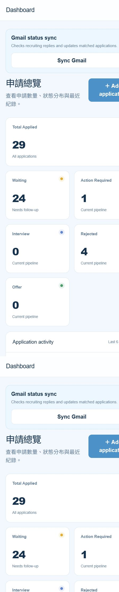

# ApplyFlow

ApplyFlow 是一個個人使用的求職申請追蹤 Dashboard。它將分散在 Google Sheets、Job Description 與 Gmail 招募信件中的資訊整合在同一個介面，讓使用者快速掌握申請數量、目前狀態及下一步需要處理的職缺。

🔗 [Live Demo](https://apply-flow.princeborn1999.chatgpt.site/)

🎤 [Interview Demo on GitHub Pages](https://princeborn1999.github.io/apply-flow/)

> The GitHub Pages version runs in demo mode. Its data stays in each visitor's browser and does not access the owner's private Google Sheet or Gmail.



## 主要功能

- **Application Dashboard**：統計 Waiting、Action Required、Interview、Rejected 與 Offer 數量。
- **Action Required 提示**：將滑鼠移到統計卡片上，即可查看需要處理的公司清單。
- **Applications 管理**：依公司、國家、狀態及日期搜尋與篩選申請紀錄。
- **Job Description 解析**：貼上完整 JD 後，自動擷取公司、國家與職位並檢查重複資料。
- **職缺適配分析**：依個人背景與 JD 關鍵條件提供中文的規則式參考評估。
- **Google Sheets 同步**：以 Google Sheet 作為主要資料來源，可新增及更新申請狀態。
- **Gmail 狀態同步**：辨識招募回覆，協助將 Waiting、Interview 或 Rejected 等結果更新至申請紀錄。
- **每日申請摘要**：新增申請後，以簡短彈窗顯示今日各國申請筆數與總數。
- **快速填表資訊**：在確認職缺未重複後，顯示常用聯絡資料以便複製。

## 操作手冊

### 1. 查看申請概況

進入 **Dashboard** 後，可以查看所有申請的狀態統計與近期活動。將滑鼠移至 **Action Required**，會顯示目前需要回覆或處理的公司。

### 2. 新增求職申請

1. 點選側邊欄的 **Add Application**。
2. 將 LinkedIn 或公司官網的完整 Job Description 貼入文字框。
3. 點選 **Check Application**。
4. 確認系統解析出的 Company、Country、Position 及職缺適配分析。
5. 若沒有重複紀錄，確認後新增申請。

### 3. 搜尋與更新紀錄

進入 **Applications**，可以：

- 搜尋公司或職位。
- 依國家及狀態篩選。
- 依日期排序。
- 更新申請狀態。
- 刪除不需要的紀錄。

### 4. 同步 Gmail 招募信件

在 Dashboard 點選 **Sync Gmail**。系統會檢查近期招募回覆，並依信件內容判斷：

- `Waiting`：尚未收到明確結果。
- `Action Required`：需要回覆、補件或進行下一步。
- `Interview`：收到面試或面談邀請。
- `Rejected`：收到拒絕通知。

同步結果仍建議由使用者確認，避免公司名稱不一致或自動分類造成誤判。

## 技術架構

- React 19
- TypeScript
- Vinext / Vite
- Tailwind CSS
- Google Apps Script
- Google Sheets
- Gmail integration
- Cloudflare / OpenAI Sites hosting

## 本機執行

需求：Node.js 22.13 或更新版本。

```bash
npm install
npm run dev
```

正式建置與檢查：

```bash
npm run lint
npm run build
npm test
```

## 環境設定

複製 `.env.example` 為 `.env.local`，填入已部署的 Google Apps Script Web App URL：

```env
VITE_GOOGLE_APPS_SCRIPT_URL=https://script.google.com/macros/s/.../exec
NEXT_PUBLIC_GOOGLE_APPS_SCRIPT_URL=https://script.google.com/macros/s/.../exec
```

請勿將包含憑證、Token 或私人 API URL 的 `.env.local` 提交到 GitHub。

## Google Sheets 與 Apps Script 設定

1. 建立或選擇一份 Google Sheet。
2. 從試算表開啟 Apps Script。
3. 將 `google-apps-script/Code.gs` 的內容加入專案。
4. 設定必要的 Sheet 欄位及 Gmail 權限。
5. 將 Apps Script 部署為 Web App。
6. 把部署 URL 寫入 `.env.local`。

主要資料欄位包含：

```text
Company · Country · Position · AppliedDate · Status
```

## 注意事項

- 此專案以個人使用情境設計，未包含多人帳號與角色權限系統。
- 職缺適配分析目前是規則式參考結果，不等同於完整 AI 模型判斷。
- Gmail 同步只應讀取與求職相關的信件，正式使用前請確認 Apps Script 的搜尋條件與授權範圍。
- Google Sheet 是主要資料來源；瀏覽器 localStorage 僅適合作為暫存或相容用途。
